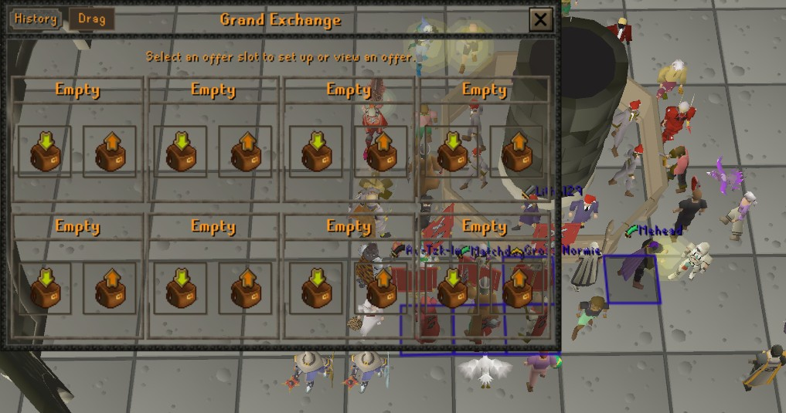
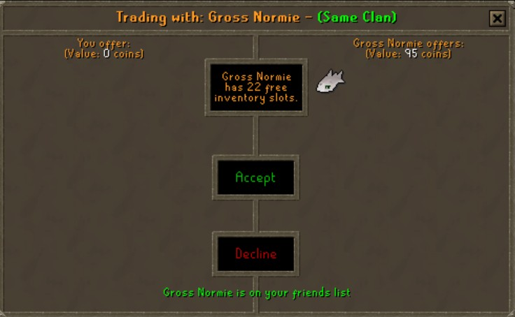
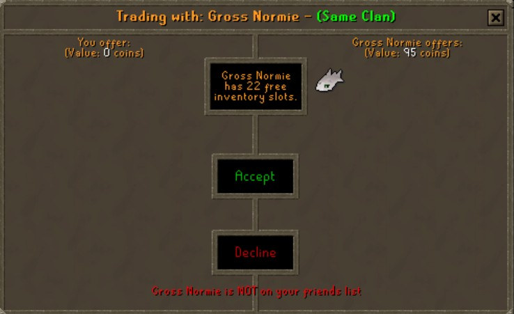
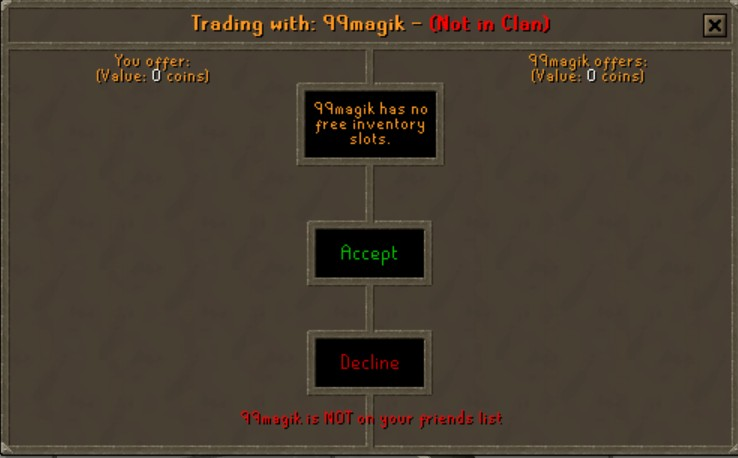

# QOL Interfaces

A RuneLite plugin that adds quality of life improvements to OSRS game interfaces.

## Features

### Transparent & Moveable Grand Exchange
Remove the background from the Grand Exchange interface for a cleaner look. A "Drag" button appears next to the History button - click and hold to reposition the window anywhere on your screen.

### Trade Friend & Clan Warning
When trading another player, the plugin displays helpful warnings to prevent scams:

**Clan Status in Title Bar:**
- Green "(Same Clan)" if they are in your clan
- Red "(Not in Clan)" if they are not

**Friends List Status at Bottom:**
- Green message if they ARE on your friends list
- Red warning if they are NOT on your friends list

#### Trading a clan member who IS on your friends list:

#### Trading a clan member who is NOT on your friends list:

#### Trading a stranger (not in clan, not on friends list):

### Transparent & Moveable Bank
Remove the background from the Bank interface. A "Drag" button appears in the title bar to reposition the window.

## Configuration

All features can be individually toggled in the plugin settings:

| Setting | Description | Default |
|---------|-------------|---------|
| Hide GE Background | Makes the Grand Exchange background transparent | Off |
| Hide Bank Background | Makes the Bank background transparent | Off |
| Moveable GE | Adds a drag button to reposition the GE window | Off |
| Moveable Bank | Adds a drag button to reposition the Bank window | Off |
| Trade Friend Warning | Shows friend/clan status when trading | On |

## Installation

This plugin is available on the [RuneLite Plugin Hub](https://runelite.net/plugin-hub/).

1. Open RuneLite
2. Click the wrench icon (Configuration)
3. Click "Plugin Hub" at the bottom
4. Search for "QOL Interfaces"
5. Click Install

## Support

If you encounter any issues or have suggestions, please open an issue on this repository.

## License

BSD 2-Clause License - See [LICENSE](LICENSE) for details.
